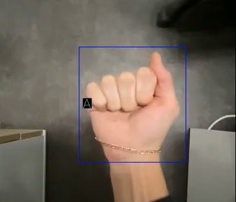

# Practical machine learning and deep learning. Project

## Ametican Sign language recognition

The following project adapts a combination of hand detection and gesture classification as the final pipeline. To build the following pipeline, we train and evaluate MobileNetV2, VGG16 classification neural networks together with YOLOv5 object detection neural network. The final pipeline is able to detect and classify hand gestures in real time.

### Demo

### Contributors
- Lada Morozova l.morozova@innopolis.university
- Rizvan Iskaliev r.iskaliev@innopolis.university
- Daniil Igudesman d.igudesman@innopolis.university
